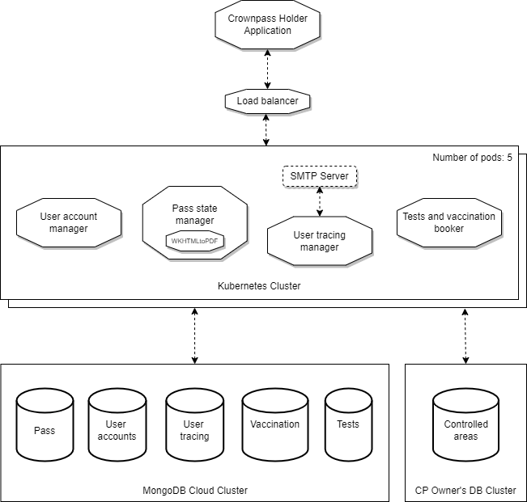

## Microservices and test report

 **Student 19179422** 
 **Coursework 2 - Module SOFT7011** 

## Introduction

The aim of this brief report, included as support documentation for this project, is to give a more accurate explanation of what each feature of the application does, regarding the endpoints set up in the different microservices that are featured in this project.

## Microservices and endpoints structure

The project consists of four different microservices that are interconnected with each other. Even though these four microservices operate independently, the front-end of the applications includes links to all these four different microservices. In order to wrap these four microservices and launch them at the same time, a Docker container with these four images is created.

| **Microservice** | **URL** | **Request** | **Action** |
| --- | --- | --- | --- |
| Tests and vaccination booker | host:5003/book | POST | Lets the holder book a vaccination. |
| Tests and vaccination booker | host:5003/booktest | POST | Lets the holder book a COVID-19 test. |
| Pass state manager | host:5002/crownpass/\<int:crownpassid\> | GET | Displays the details of the user&#39;s crownpass, such as the QR, the picture, the name, and the infection and vaccination status. |
| Pass state manager | host:5002/print/\<int:crownpassid\> | GET | Converts the Crownpass to a PDF file and returns it as a response (WkHTMLtoPDF is installed in the Docker image containing the pass application. |
| Pass state manager | host:5002/qr/\<int:crownpassid\> | GET | Generates a QR that will be scanned to let the user into a controlled area. |
| Pass state manager | host:5002/authorize/\<int:crownpassid\> | POST | Opens a form through which the user selects a controlled area and confirms whether he is doing a check-in or a check-out. |
| User tracing manager | host:5001/showtrace/\<int:crownpassid\> | GET | Displays three tabs with the following data.- Check-in and check-out history of the user.- COVID-19 tests booked by the user.- Vaccinations booked by the user. |
| User tracing manager | host:5001/notifyPositiveTest/\<int:crownpassid\> | GET | Sends an e-mail to the user whose tested has been reported as positive, confirming the test result. |
| User account manager | host:5000/photo/\<int:crownpassid\> | GET | Decodes the Base64 string that contains the picture of the specified user and returns it as a JPG file. |
| User account manager | host:5000/register | POST | Creates a new user and a new Crownpass given certain parameters such as the picture, |
| User account manager | host:5000/login | POST | Lets the user log into the system given his Crownpass ID. |
| User account manager | host:5000/settings | POST | The user will be able to change some of his profile settings and reset his movement tracing. |
| User account manager | host:5000/wipetracing | GET | Lets the user clear his movement tracing history (redirected previously by the user settings section). |
| User account manager | host:5000/logout | GET | Logs the user out. |

##

## Microservices diagram

## Test report

The following report contains an accurate description of all the unit and integration tests run to test the compliance with the quality requirements. In order to test the different clients, four clients have been instantiated, each one belonging to each application. In order to measure the time elapsed for each request, two timestamps are recorded before and after completing the request. The difference between these two timestamps will be the time elapsed.

**Fixtures** : Booker client, User account app client, User tracing client, Pass application client.

| **Test** | **Description** | **Precondition** | **Assertion** | **Pass / Fail** |
| --- | --- | --- | --- | --- |
| test\_crownpassReg | The time for the process of registration of a Crownpass user (QR-PF-01) is tested. | The client is up and running, the cloud database is up and running and the user has not been registered before. | (end - start) \< 20 and response.status\_code == 200 | Pass |
| test\_checkInCheckOut | The time elapsed for check-in and check-out operations, ran in a POST request, is measured, to comply with QR-PF-02 and QR-PF-03. | The user tracing app and the cloud databases are up and running. | (end - start) \< 13 and response.status\_code == 200 | Pass |
| test\_changePassRed | In this test, QR-PF-04 and QR-PF-08 are combined, as a notification must be sent via email after changing the pass state of a user. Therefore, the time elapsed for the compliance of both requirements is combined. | The Pass application and the cloud pass database are up and running. The client of the pass service is connected to the Gmail SMTP server to send the notification. | (end - start) \< 11 and response.status\_code == 200 | Pass |
| test\_changePassAmber | The database in the cloud is accessed to change the Crownpass&#39; state to Amber. | The cloud database is up and running. | (end - start) \< 5 | Pass |
| test\_changePassGreen | The database in the cloud is accessed to change the Crownpass&#39; state to Green. | The cloud database is up and running. | (end - start) \< 5 | Pass |
| test\_privacy | QR-SE-01: Individual User Data Privacy Protection.The following elements of a Crownpass holder&#39;s data are private and can only be accessed for modification by the user of the Crownpass holder. Name and address, contact details, and user tracing. | The user whose data is attempting to be retrieved is not logged in. | Response.statuscode = 500 | Pass |
| test\_modifyData | The user whose data is attempting to be modified is not logged in. | | KeyError(&quot;user&quot;) | Pass |
| test\_loginOK | Sending a POST request to the login URL. | The ID of the user contained in the POST request is already registered. | Response.status\_code = 200 | Pass |
| test\_loginError | Sending a POST request to the login URL. | The ID of the user contained in the POST request has not been registered. | Response.status\_code = 500 | Pass |
| test\_bookCovidTest | Test ran to verify that the COVID-19 tests can be successfully booked. The length of the tests table of the database is measured before and after the POST request. | The user has been previously registered. | response.status\_code == 200 and lengthAfter \> lengthBefore | Pass |
| test\_bookVaccination | Test ran to verify that the COVID-19 vaccinations can be successfully booked. The length of the vaccinations table of the database is measured before and after the POST request. | The user has been previously registered. | response.status\_code == 200 and lengthAfter \> lengthBefore | Pass |